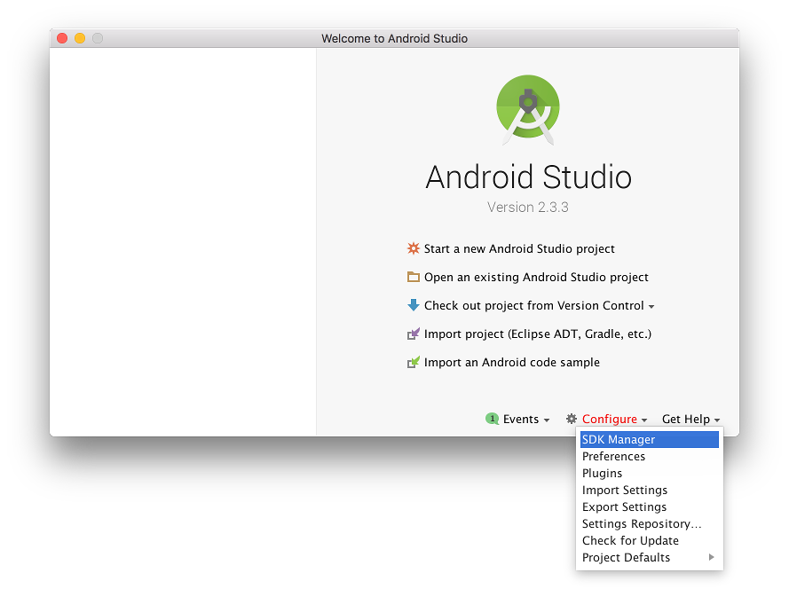

# 将MV/MZ项目导至Android端 - MV Android Client 中文手册

*翻译自用

<br>

原始教程：[RPG Maker Forum - Exporting to Android (MV Android Client)](https://forums.rpgmakerweb.com/index.php?threads/exporting-to-android-mv-android-client.84971/)

注：

根据[该求助帖](https://forums.rpgmakerweb.com/index.php?threads/how-to-create-an-apk-file-for-rpg-maker-mz-not-mv.147603/post-1275039)的内容，本教程也可用于 MZ 项目

根据[该评论](https://forums.rpgmakerweb.com/index.php?threads/exporting-to-android-mv-android-client.84971/page-12#post-947883)的内容，本教程也可用于 VN Maker 项目

<br>

## MV Android Client 是什么

MV Android Client (MV 安卓客户端) 是一个用于 [Android™ 操作系统](https://www.android.com/)的进行时客户端，目的是令由游戏开发工具 [RPG Maker MV](http://www.rpgmakerweb.com/) 制作而成的游戏在安卓系统上运行。

- [下载源代码](https://github.com/AltimitSystems/mv-android-client/zipball/master)

- [在Github上查看](https://github.com/AltimitSystems/mv-android-client)

本教程使用 MV Android Client 来将 RPG Maker MV 工程编译为安卓可运行的文件（即将工程部署为APK文件）。

<br>

## 前置准备

### 1. MV Android Client

从以下链接获取 MV Android Client 源码：

https://github.com/AltimitSystems/mv-android-client/zipball/master

或使用git克隆Github存储库：

https://github.com/AltimitSystems/mv-android-client.git

下载下来的文件是 MV Android Client 最新版本的zip压缩包。

请将zip内的文件提取至一个好记的路径（例如电脑桌面）。

### 2. 开发环境

用于安卓软件开发的官方IDE是谷歌的 [Android Studio](https://developer.android.com/studio/index.html)。

可以在以下链接下载 [macOS](https://www.apple.com/macos), [Microsoft Windows](https://www.microsoft.com/windows) 和 [Linux](https://www.linuxfoundation.org/projects/linux)版本的 Android Studio ：

https://developer.android.com/studio/index.html

对用于不同平台的 Android Studio 安装指引请查询以下链接：

https://developer.android.com/studio/install.html

### 3. 安卓 SDK 库

首次打开 Android Studio 时，你会看见一个欢迎窗口，上面显示着当前 Android Studio 的版本和一些用于创建项目的快捷选项。



如果你并不是第一次打开 Android Studio，看到的是先前的项目，那么你可以从 `File` 菜单关闭当前项目，然后选择 `Close Project` 以打开欢迎窗口。

位于欢迎窗口右下角的是 `Configure` (配置) 菜单。点击这一菜单，然后选择 `SDK Manager` 就可以打开 Android SDK Manager (安卓 SDK 管理器) 。在这里你可以为你的项目下载所需的安卓 SDK 库。

在已经打开的项目中，你也可以通过点击 `Tools` (工具) 菜单，选择子菜单 `Android` ，然后选择 `SDK Manager` 来打开安卓 SDK 管理器。

### 4. 所需的 SDK 平台

安卓 SDK 管理器具有三项栏目：`SDK Platforms` (SDK 平台), `SDK Tools` (SDK 工具) 和 `SDK Update Sites` (SDK 更新站点)。

为了下载所需的 SDK 平台，请先选中 `SDK Platforms` 栏目。在这一栏目中，你可以为多种版本的安卓下载开发库。

通常来说，最好选择下载最新版本的安卓。在本教程编写期间，最新版的安卓是 Android 8.0 (Oreo) 。

勾选其他需要安装 SDK 的安卓版本左侧的框，随后点击 `Apply` (应用) 以开始下载所需的 SDK 平台。


### 5. 所需的 SDK 工具

下载好 SDK 平台后，选中 `SDK Tools` (SDK 工具) 栏目来下载用于开发安卓软件的工具。

在这个列表中，勾选以下 SDK 工具左侧的框：

- Android SDK Build-Tools
  
- Android SDK Platform-Tools
  
- Android SDK Tools
  
（注：不再需要 Support Repository 了）


如果你希望在真实的设备上测试软件且使用 Windows 系统，你也需要勾选 `Google USB Driver`。

点击 Apply 即可开始下载所需的 SDK 工具。

### 6. 部署完毕的 RPG Maker MV 工程

为了使 RPG Maker MV 游戏用于安卓系统，你必须在编辑器中点击 `File` (文件) 菜单，然后选择 `Deployment` (部署) 选项。


在部署窗口中，选中选项 `Android/iOS平台` 。你也可以勾选选项 “排除未被使用的文件” 。然而，这可能导致一些依赖外部文件的插件崩溃。


记得选择一个用于部署的输出路径，点击“选择...”选项即可。由于之后你需要找到这个部署完毕的项目，所以请选个好记的路径来部署（例如电脑桌面）。

<br>

## 创建安卓APP

### 1. 打开 MV Android Client

在 Android Studio 欢迎界面中，选择 `Open an existing Android Studio project` (打开现有的AS项目)。

找到先前在“前置准备”篇章开头已解压的 MV Android Client 源码文件夹。


选中该文件夹，使其处于高亮状态，随后点击 OK 。在打开文件夹之后，Android Studio 会花一些时间来构建项目。

耐心等待项目在 Android Studio 中加载完毕。工程会自动下载额外所需的库，所以在加载项目时需要联网。


当一切准备完毕，展开位于最左上角的 `Project` 栏目，然后展开最左下角的 `Build Variants` 栏目。

展开 `Project` 栏目中的 `app` 文件夹，里面应该会有 `manifests` , `java` 代码和 `xml` 值。

`Build Variants` 栏可在 `Crosswalk` 和 `WebView` 中任选一项用作默认网络引擎。

Crosswalk 开发结束于 2017 年 1 月，所以最好使用 WebView 。然而早期版本的设备不一定能完全兼容 WebView 特性。你可以在本教程结尾查看对 Crosswalk 和 WebView 的进一步剖析。

### 2. 导入部署完毕的 RPG Maker MV 工程

#### a. 创建资源文件夹

如果在 Android Studio 的 app 文件夹中没有资源文件夹，那么必须创建一个。资源文件夹用于存储部署完毕的 RPG Maker MV 项目。

右键点击 app 文件夹来打开上下文菜单。打开 New 子菜单，随后打开靠下的 Folder 子菜单，在这里选择 Assets Folder 来创建资源文件夹。


在出现的窗口上直接点击 OK 即可。


#### b. 复制 RPG Maker MV 工程

找到在前置准备中创建的 RPG Maker MV 工程。目录中应该有一个名为 www 的文件夹。


选中 www 文件夹使其处于高亮状态，然后右键打开上下文菜单，点击“复制”选项复制该文件夹。

再次打开 Android Studio ，右键点击 assets 文件夹 (即创建好的资源文件夹) ，通过点击 paste 选项将 www 文件夹复制过来。


在出现的复制窗口中，不要勾选 Open copy in the editor 选项，这样做是为了防止 MV 工程文件在 Android Studio 中被打开。之后点击 OK 。


将工程复制到 Android Studio 需要一段时间才能完成，时间长短取决于工程的大小。

### 3. 修改 applicationId

安卓 applicationId (应用程序ID) 必须是你工程独有的。

展开 Gradle Scripts 文件夹，之后打开 build.gradle (Module: app) 文件。


你应该会看见如下图所示的代码。找到 defualtConfig 中写有 applicationId 的那一行。


将双引号中的文本更改为新的 applicationId 。安卓 applicationId 不能包含空格，必须仅由小写的拉丁字母组成，每个单词之间用英文句号分隔。

一般情况下，安卓应用程序 ID 由反向的域名和写在ID最后的应用程序名称组成。举个例子：一个运行在 HBGames.org 上，名为 Adventure 的项目的安卓应用程序 ID 将是 org.hbgames.adventure 。

如果你没有站点域名，你也可以使用你的姓和名。假设一个叫 Harry Potter 的人创建了一个名为 Owl Chronicles 的项目，这个项目的安卓应用程序 ID 将是 potter.harry.owlchronicles 。

对于你的工程和工作室来说，安卓应用程序 ID 必须是独一无二的。


<br>

## 测试（可选）

如果你有一台安卓手机，你可以将其连接到电脑以直接测试你的 MV 工程。

设置手机进行测试的指南可以在以下链接获取到：

https://developer.android.com/studio/run/device.html

或者，你也可以创建一台安卓虚拟机实例。虚拟机运行在电脑上，不需要使用真实的安卓手机。

创建虚拟机实例的指南可以在以下链接获取到：

https://developer.android.com/studio/run/emulator.html

<br>

## 创建调试用APK

在 Android Studio 中，选择菜单栏中的 Build 菜单，然后点击 Build APK (构建 APK)。


该操作将会编译并构建你的应用程序，可能会花费一些时间。构建完成时，你会在左下角看到一条确认消息，其中包含一条指向构建完毕的 APK 的快捷链接。


构建完毕的 APK 是用于调试的，还不能上架 Google Play 商店。本教程不包括上架发行版 APK 的方法，我们也不会对关于发行版 APK 的问题给予帮助。创建发行版 APK 的相关信息请查阅以下链接：

https://developer.android.com/studio/publish/index.html

<br>

## 自定义项

大多数自定义项可以在 values.xml 文件中设置。


### 1. APP 名

若想重命名你的 APP ，请打开 values.xml 文件并找到 app_name 条目。默认情况下，APP 名为 RPG Maker MV 。

对于非拉丁字母（如中文），必须使用 Unicode 编码。请使用 Unicode 转换器生成编码以在 XML 文件中使用。

### 2. APP 网站

values.xml 中也可以配置 APP 网站。将app_host 条目设为你的站定域名，并将 app_scheme 条目设为 HTTP 或 HTTPS 。举个例子，如果我的网站是 https://www.hbgames.org ，那么我的 app_scheme 就是 https ，app_host 就是 hbgames.org 。

之后，我的网站需要与 APP 产生关联。另见以下链接中 Associate your app with your website (将应用与网站相关联) 部分：

https://developer.android.com/studio/write/app-link-indexing.html

### 3. APP 图标

打开 res/mipmap 文件夹，你可以看见所有的图标。


这里准备了多种图标，用于适配不同安卓版本，而不同大小的图标可用来适配不同的设备。

你可以将所有的默认图标删除，但你必须换上两个新的图标，一个命名为 app_icon ，另一个命名为 app_icon_round 。

图标可以是 PNG 格式。你也可以通过 Android Studio 创建图标图像，只要右键点击 mipmap 文件夹，打开 New 子菜单后选中 Image Asset 即可。

关于 Image Asset Studio 的指南可以在以下链接找到：

https://developer.android.com/studio/write/image-asset-studio.html

记得一定要将两个图标分别命名为  app_icon 和 app_icon_round ！理想情况下，app_icon_round 应该是一个圆形图标。


## Crosswalk vs. WebView

Crosswalk 是英特尔的一个项目，旨在为 Android 创建一个可移植的 WebView 替代方案，该方案可跨多个版本的 Android 运行。https://crosswalk-project.org/

你可能从 Intel XDK, Cordova 或 PhoneGap 了解过 Crosswalk 。它也是 RPG Maker MV“官方”的 Android 部署方案的一部分。

现代 Android 已经将 WebView 组件与操作系统分离，因此旧版本的 Android 现在可以接收 WebView 的关键安全更新，不再需要完整的操作系统更新。这使得 Crosswalk 变得多余，因为 Crosswalk 的主要目标正是为旧版本的 Android 提供 WebView 更新。

那么，为什么要使用 Crosswalk 呢？因为遗憾的是，WebView 更新还没有为旧设备启用一些功能。也就是说，WebAudio 和 WebGL 可能无法用于旧版的 Android 手机。Crosswalk 可能会对旧版设备实施这些措施，因此使用 Crosswalk 时，兼容性有可能得到提升。

然而，这并不是一个双赢的局面。WebView 可以在比 Crosswalk 更旧的 Android 版本上工作（可以追溯到Android 3.0 Honeycomb API 11）。对于较新的设备，WebView 甚至可能比 Crosswalk 更快。

关键的区别在于，Crosswalk 不再处于开发状态，因此它将不会收到安全更新。如果 Crosswalk 中出现了一个漏洞，允许人们通过你的应用程序或游戏黑进设备和破解手机，那么你就倒霉了。有了 WebView ，谷歌的更新将迅速解决这个问题。

WebView 本身也是 Android 的核心部分。使用 Crosswalk 会增加APK的大小，因为所有潜在版本的 Android 和手机设备的 Crosswalk 库和文件都需要包括在内。

像我这样有安全意识的开发人员的建议是，应该使用 WebView ，避免使用 Crosswalk 。Crosswalk 的使用风险需自行承担。

如果未来确实出现了 Crosswalk 的严重安全问题，它将从未来版本的 MV Android Client 中移除。

<br>

## ※ 补充功能（来自评论区）

### 1. 将游戏模式从横屏改为竖屏

打开 AndroidManifest.xml ，找到以下代码：

```xml
android:screenOrientation="sensorLandscape"
```

将“sensorLandscape”改为“portrait”即可。

### 2. 移除退出消息

打开 values.xml ，将退出消息数组清空即可。

### 3. 在 Android Studio 中更改 Crosswalk 版本

（据说如果将 Crosswalk 版本设为 18.48.477.13 就可以解决声音相关的问题）

打开 build.gradle 文件，找到以下代码：

```
zz_crosswalkImplementation 'org.xwalk:xwalk_core_library:23.53.589.4'
```

将其中那一串数字更改成版本号。

<br>

## ※ 疑难解答（来自评论区）

**Q1：在 Android Studio 中添加 Assets 文件夹时，上下文菜单中没有出现 Assets 文件夹创建选项，怎么办？**

A1：你可以通过电脑操作系统自带的文件浏览器自行添加 Assets 文件夹。记得将文件夹命名为 assets 。同样，你也可以通过操作系统直接将 www 文件夹复制到 Assets 文件夹中。

---

**Q2：为什么游戏运行在手机上时没有声音？**

A2：可能是因为所使用的设备不支持 Web 音频，也可能因为 Web 音频或所使用的设备不支持游戏使用的音频格式。

https://developer.android.com/guide/topics/media/media-formats.html

https://developer.mozilla.org/en-US/docs/Web/HTML/Supported_media_formats

据某位使用者分享的经历来看，也有可能是 BGM 文件在被复制到 Assets 文件夹时无故被删除了。到时候自行将音乐再添加进去即可。手机上默认使用 .m4a 格式音频。

还有一种可能，在游戏过程中音频需要时间来加载，有些音频由于加载时间过长，在场景结束后才加载出来，这就导致在场景进行期间没有声音。为了解决这一问题，可以使用预加载器插件预加载音频或其他资源。
例如：[AudioStreaming.js](https://forums.rpgmakerweb.com/index.php?threads/audiostreaming-js-plugin-to-improve-rpg-maker-mv-audio-performance.110063/)

---

**Q3：用 WebView 打包后在手机上运行游戏时，游戏窗口没有正确绘制，怎么办？**

A3：Windows 版本 Google Chrome v69 或更高版本似乎有一个问题，即 RPG Maker MV 制作的游戏窗口无法正确显示（内容和背景颜色消失）。针对这一问题，日本那边已经有人制作出了补丁插件，可以试试：[FixWindowDrawing.js](https://raw.githubusercontent.com/krmbn0576/rpgmakermv/master/js/plugins/FixWindowDrawing.js
)

---

**Q4：Android Studio 调控台显示 Failed to resolve: play-services-basement ，怎么办？**

A4：你需要更新 libgoogleplay 中 build.gradle 的 Google Play 库。

找到以下两行代码：

```
implementation 'com.google.android.gms:_play-services-games:16.0.0'
```
修改成以下内容：
```
implementation 'com.google.android.gms:_play-services-auth:16.0.1'
```

---

**Q5：在手机上测试时出现以下错误该怎么办？
Webpage not available
The webpage at file:///android_asset/www/index.html?webgl could not be loaded because
net::ERR_FILE_NOT_FOUND**

A5：请将部署好的 MV 项目按照教程放到正确的位置。

---

**Q6-1：在手机上测试时黑屏，只在左上角出现了一个安卓图标，这是怎么回事？**

**Q6-2：打包成功之后看到一条消息：**
```
NOTE :
Downloads\AltimitSystems-mv-android-client-6b33d6f\AltimitSystems-mv-android-client-6b33d6f\app\src\webview\java\systems\altimit\rpgmakermv\WebPlayerView.javauses or overrides a deprecated API.
Note: Recompile with -Xlint:deprecation for details.
```
**这是怎么回事？**

A6：出现这个错误是因为你将整个部署好的项目文件夹放进了 Assets 文件夹中。只要将部署好的项目文件夹中的 www 文件夹复制进去就可以了。

---

**Q7：在手机上测试时弹出错误信息 Failed to load: audio/bgm/courtesy%20call.m4a ，怎么办？**

A7：Windows 以外的环境通常不允许文件名中包括空格。为了保险起见，建议只使用小写英文字母、-和_来命名文件。

---

**Q8：在手机上游戏时，每当对角色或敌人产生暴击，游戏就会卡顿，怎么办？**

A8：试着关闭闪烁和色调特效，这些特效可能会使安卓设备超载。

---

**Q9：输出的调试用 apk 在哪里？**

A9：\AltimitSystems-mv-android-client\app\build\outputs\apk\webview\debug\app-webview-debug.apk

（译者&整理者：Rosa）